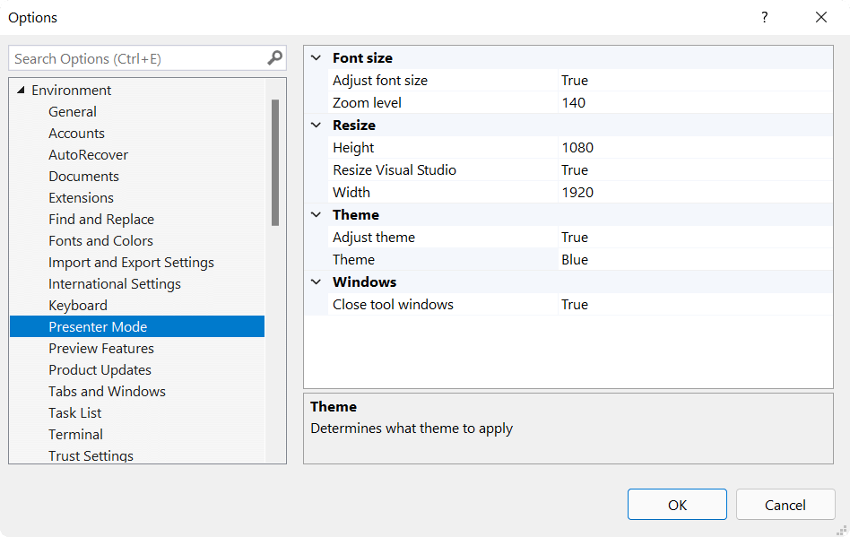

# Presenter Mode

A one-click button for entering presntation mode which resets fonts, themes, tool windows and resizes Visual Studio itself. Great for video recordings and screen captures.

Download this extension from the [Marketplace](https://marketplace.visualstudio.com/items?itemName=MadsKristensen.PresenterMode)
or get the [CI build](https://www.vsixgallery.com/extension/RecordingDefaults.aa418e38-6c48-42a8-b461-a575b9e4f26a).

-----------------------------------------

Optimizes Visual Studio for video recordings, screen captures and screen sharing with a single click.

It does that by:

1. Resetting font sizes
2. Zooms the editor
3. Applies the Blue theme
4. Resizes Visual Studio itself

This is all configurable, but defaults to settings that are optimized for screen recordings.

## License
[Apache 2.0](LICENSE)
